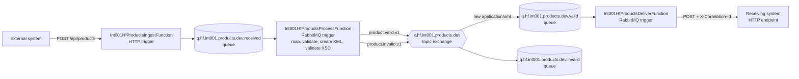

# TL;DR

This solution receives external JSON products over HTTP and processes them asynchronously with three .NET 10 isolated Azure Functions.
The three Functions are hosted in one Function App/project, so they form one simple deployment unit for this assignment.
`Int001HfProductsIngestFunction` accepts the request and publishes a correlation-aware envelope to RabbitMQ.
`Int001HfProductsProcessFunction` transforms and validates the canonical product, creates XSD-validated XML, and routes valid XML or invalid JSON.
`Int001HfProductsDeliverFunction` forwards receiver-ready XML to the target unchanged using `HttpClientFactory`.
RabbitMQ provides buffering through queues and valid/invalid routing through a topic exchange.
Business-invalid products remain in `q.hf.int001.products.dev.invalid`; technical failures are thrown for the trigger extension to retry.
Run Azurite, provide local RabbitMQ settings, then start the Function app with `dotnet run` from the Function project.

## Documentation

The [documentation index](docs/README.md) links the implementation plan and identifies the root README as the operational quick start.

## Architecture



The application declares the durable queues, topic exchange, and bindings after building the worker host but before Function invocations begin. Publishing uses persistent messages, mandatory routing, and broker confirmations.

## Functions

All three individual Functions are hosted in the same Function App. They are deployed and scaled together. Separate Function Apps would only be warranted if production requirements called for independent deployment, scaling, configuration, permissions, or stronger failure isolation.

- `int001-hf-products-ingest` (`Int001HfProductsIngestFunction`) — accepts `POST /api/products`, handles malformed JSON, creates or reuses a correlation ID, publishes the external product envelope, and returns HTTP 202.
- `int001-hf-products-process` (`Int001HfProductsProcessFunction`) — consumes `q.hf.int001.products.dev.received`, maps to `CanonicalProduct`, applies business validation, serializes and XSD-validates the canonical XML, then publishes valid XML or a JSON business-error message.
- `int001-hf-products-deliver` (`Int001HfProductsDeliverFunction`) — consumes receiver-ready XML from `q.hf.int001.products.dev.valid` and sends that same XML to the configured HTTP target without remapping or reserialization.

## Naming convention

`int001` is the stable integration identifier and `hf-products` is the workload. Azure resource names use `<resource-type>-<integration>-<workload>-<environment>-<instance>`, for example `func-int001-hf-products-dev-001`. The environment is intentionally omitted from individual Function names because the same build should deploy unchanged to every environment.

RabbitMQ uses lowercase dot-separated names:

| Type | Pattern | Development value |
|---|---|---|
| Exchange | `x.<org>.<integration>.<domain>.<environment>` | `x.hf.int001.products.dev` |
| Queue | `q.<org>.<integration>.<domain>.<environment>.<purpose>` | `q.hf.int001.products.dev.received` |
| Routing key | `<entity>.<outcome>.<contract-version>` | `product.valid.v1` |

Use `test`, `stg`, or `prod` in configured RabbitMQ resource names for other environments. Prefer a separate RabbitMQ virtual host per environment as an additional isolation boundary. Names beginning with `amq.` are reserved by RabbitMQ.

## Data flow

The HTTP Function intentionally performs only transport-level checks. A syntactically valid product is accepted for asynchronous processing, wrapped with `CorrelationId` and `ReceivedAtUtc`, and placed on `q.hf.int001.products.dev.received`.

The processing Function maps it to `CanonicalProduct`, adds `ProcessedAtUtc`, and applies business validation. For a valid product it creates the final `ProductDelivery` XML document, validates it against the embedded `ProductDelivery.xsd`, and publishes the raw UTF-8 XML with content type `application/xml` and routing key `product.valid.v1`. RabbitMQ routes that receiver-ready document to `q.hf.int001.products.dev.valid`; the delivery Function only extracts correlation metadata and posts the XML unchanged.

## Error handling

Malformed HTTP JSON returns HTTP 400 and is never queued. If RabbitMQ cannot confirm the ingest publication, the request returns HTTP 503 with its correlation ID.

Business validation errors do not throw. They produce an `ErrorProductMessage` containing the correlation ID, product ID, stable `INVALID_PRODUCT` code, readable errors, and original payload. That message is routed to `q.hf.int001.products.dev.invalid`, and the input message completes successfully so later products continue processing.

Technical failures such as a broker publish failure, malformed broker envelope, XML schema failure, target timeout, or non-success target response are logged and thrown. With RabbitMQ extension 2.1.0, a failed trigger invocation is retried up to five attempts. This sample deliberately has no technical dead-letter exchange; after the final failed attempt the extension rejects the message and RabbitMQ discards it. A production solution should retain exhausted technical failures in a dead-letter queue.

The broker-to-broker handoff is at-least-once rather than atomic. A crash after publishing the next message but before acknowledging the current message can create a duplicate. The target should therefore be idempotent in production, for example by upserting against a stable message or product key.

## Correlation and logging

Callers may supply `X-Correlation-Id`; otherwise the ingest Function generates a GUID. The value is returned to the caller, stored in each message envelope, set as a RabbitMQ message property, forwarded as an HTTP header, and included in structured logs.

Logs use message templates rather than interpolated strings. Useful fields include `FunctionName`, `Stage`, `Status`, `ProductId`, `CorrelationId`, and `ErrorCode`.

## Running locally

Prerequisites:

- .NET 10 SDK
- Azure Functions Core Tools v4
- Node.js/npm for Azurite, or another local Azurite installation
- A reachable RabbitMQ 4.x broker with the Management plugin optional

### One-command startup

After creating `local.settings.json`, start the local components from the repository root with:

```powershell
.\Start-Local.ps1
```

If the PowerShell execution policy blocks local scripts, use:

```powershell
powershell -ExecutionPolicy Bypass -File .\Start-Local.ps1
```

The script starts Azurite, the Function App, and the local receiving system in separate windows when needed, waits for all local ports, and prints the available endpoints. RabbitMQ runs independently with its Docker restart policy and is not changed by this script.

### Manual startup

Install Azurite once if it is not already available:

```powershell
npm install -g azurite
```

Create local configuration and replace every RabbitMQ placeholder with the dedicated application account values:

```powershell
Copy-Item src\IntegrationAssignment\local.settings.example.json `
  src\IntegrationAssignment\local.settings.json
```

Start Azurite in terminal 1 from the repository root:

```powershell
azurite --silent --location .azurite
```

Build and test in terminal 2:

```powershell
dotnet build HultaforsPoc.sln
dotnet test HultaforsPoc.sln
```

Start the local receiving system in terminal 2:

```powershell
Set-Location src\MockProductReceiver
dotnet run
```

Start the Functions app in terminal 3:

```powershell
Set-Location src\IntegrationAssignment
dotnet run
```

The endpoints are then available at:

```text
POST http://localhost:7071/api/products
POST http://localhost:7072/products
```

The .NET isolated template invokes Core Tools through `dotnet run`. `func start` may also be run from `src/IntegrationAssignment` after the project has been built.

### Optional RabbitMQ Compose setup

The sample in `docker/rabbitmq` binds both published ports to one configured LAN address rather than all interfaces:

```bash
cd docker/rabbitmq
cp .env.example .env
# Replace placeholders in .env, then:
docker compose up -d
docker compose ps
```

Create a non-administrator application user with permissions only in the dedicated vhost:

```bash
docker compose exec rabbitmq rabbitmqctl add_user product_integration '<strong-generated-password>'
docker compose exec rabbitmq rabbitmqctl set_permissions -p hf-products-dev product_integration '.*' '.*' '.*'
```

Use the vhost configured in `.env` instead of `hf-products-dev` if it differs. Full configure/write/read permissions are intentionally scoped to this app-only vhost. Do not expose ports 5672 or 15672 to the public internet.

## Configuration

`local.settings.json` is ignored by Git. Its relevant settings are:

| Setting | Purpose |
|---|---|
| `AzureWebJobsStorage` | `UseDevelopmentStorage=true` for local Azurite |
| `RabbitMQConnection` | AMQP URI used by the official Functions triggers |
| `RabbitMQ__Host`, `__Port`, `__Username`, `__Password`, `__VirtualHost` | Connection used by the RabbitMQ publisher |
| `Queues__ProductReceived`, `__ProductValid`, `__ProductInvalid` | Application topology queue names |
| `ProductReceivedQueueName`, `ProductValidQueueName` | Flat aliases required by trigger attribute placeholders |
| `Exchanges__ProductValidationResults` | Result topic exchange name |
| `RoutingKeys__ProductValid`, `__ProductInvalid` | Result routing keys |
| `TargetApi__BaseUrl` | Base URL for the target API; keep the trailing slash |

The hierarchical queue values and their flat trigger aliases must match.
Likewise, `RabbitMQConnection` and the five hierarchical `RabbitMQ__...` settings must identify the same broker, account, and vhost. This duplication exists because the trigger binding consumes a connection URI while the application publisher binds strongly typed settings.

Percent-encode reserved characters in the URI username, password, and vhost (for example `@`, `:`, `/`, `#`, and `%`). Keep the raw values in the matching hierarchical publisher settings.

## Example requests

Valid product:

```bash
curl -i http://localhost:7071/api/products \
  -H 'Content-Type: application/json' \
  -H 'X-Correlation-Id: demo-valid-001' \
  --data '{"productId":"P-1001","name":"Hammer","price":249.90,"currency":"SEK","stockQuantity":25,"category":"Tools"}'
```

Invalid product, accepted asynchronously and routed to `q.hf.int001.products.dev.invalid`:

```bash
curl -i http://localhost:7071/api/products \
  -H 'Content-Type: application/json' \
  -H 'X-Correlation-Id: demo-invalid-001' \
  --data '{"productId":"P-1002","name":"Invalid hammer","price":-5,"currency":"GBP","stockQuantity":-1,"category":"Tools"}'
```

## Tests

```powershell
dotnet test HultaforsPoc.sln
```

The nine unit tests cover business validation, deterministic external-to-canonical mapping, canonical XML serialization, successful XSD validation, and rejection of schema-invalid XML. They do not require Functions, RabbitMQ, or Azurite.

## Assumptions

- Currency matching is normalized to uppercase, so `sek` becomes `SEK` before validation.
- Whitespace is trimmed from text fields; blank values become `null` and fail required-field validation.
- Category has no business rule in the assignment and may be absent.
- The result exchange is a topic exchange because it mirrors a topic/subscription-style result stream, although exact routing keys are used in this sample.
- Queue consumers may receive duplicate messages; no database-backed idempotency store is included.
- The valid queue contract is raw canonical `ProductDelivery` XML version `1.0`; it does not embed the original JSON. The invalid queue remains a JSON business-error contract.

## Production considerations

- Store the RabbitMQ connection URI in Azure Key Vault and expose it through a Key Vault app-setting reference. The Function App's managed identity can read Key Vault, but the official Azure Functions RabbitMQ binding itself does not support Microsoft Entra authentication or managed identity.
- Consider Azure Service Bus when native Azure identity, managed broker operations, duplicate detection, scheduled delivery, and built-in dead-lettering are more important than local RabbitMQ portability.
- Send structured telemetry to Application Insights/Log Analytics and alert on failed invocations, retry exhaustion, queue depth, message age, and target latency.
- Set Function and RabbitMQ consumer concurrency according to downstream capacity; scale out gradually and load-test ordering/idempotency assumptions.
- Add a technical dead-letter exchange, idempotent target handling, and an operational replay process.
- Define broker/cloud resources with Bicep or Terraform and use CI/CD for build, tests, configuration validation, and deployment.

## AI usage

AI/Codex was used as the primary implementation assistant and generated much of the initial C# code, Docker Compose configuration, tests, and documentation.

I supplied the assignment and directed the architecture, including the separation into Ingest, Process, and Deliver, the RabbitMQ queue flow, the canonical JSON-to-XML transformation, validation boundaries, and error handling.

I reviewed and modified the implementation, studied it file by file, and verified the result through builds, unit tests, RabbitMQ inspection, end-to-end demonstrations, and load tests.
