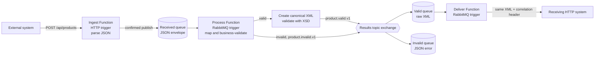
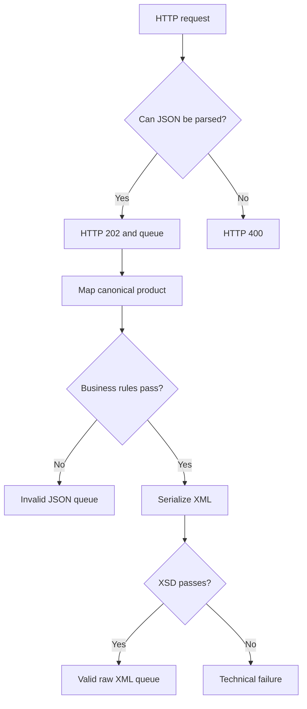

# Cloud Integration Solution — Implementation Plan and Record

## TL;DR

The planned solution is implemented: three .NET isolated Azure Functions turn accepted product JSON into canonical, schema-valid XML through RabbitMQ, isolate business-invalid products, and forward valid XML unchanged. Build, nine unit tests, end-to-end flows, retry behavior, queue recreation, and two 10,000-request exercises were verified; production dead-lettering, idempotency, TLS, infrastructure as code, and monitoring remain explicit backlog items.

## Goal

Build a small, production-minded integration that runs locally without requiring an Azure subscription. It must accept external product JSON, use at least three cooperating Azure Functions, perform asynchronous transformation and validation, produce XML for a receiver, separate valid and invalid outcomes, and demonstrate logging, tests, configuration, and failure handling.

This document is both the plan and the implementation record. Checked items are present and verified in the repository.

## Definition of done

- [x] Three cooperating .NET 10 isolated Azure Functions run in one Function App/project.
- [x] Two Functions use non-HTTP RabbitMQ triggers.
- [x] Ingress rejects only malformed or empty JSON synchronously.
- [x] A valid product moves asynchronously from external JSON to canonical model to XSD-valid XML.
- [x] The valid queue contains raw receiver-ready XML.
- [x] A business-invalid product is routed as JSON to a separate invalid queue.
- [x] Invalid business data does not prevent a later valid product from processing.
- [x] Delivery forwards the same XML body instead of recreating it.
- [x] Correlation IDs cross HTTP, RabbitMQ, XML/JSON contracts, logs, and the target request.
- [x] Publisher confirmations and trigger acknowledgements are used at their respective handoff points.
- [x] Technical failures and business-invalid outcomes behave differently.
- [x] Unit tests cover canonical mapping, business rules, XML serialization, and XSD validation.
- [x] `dotnet build` and `dotnet test` pass.
- [x] Safe example configuration is committed; real local settings and `.env` are ignored.
- [x] A reproducible RabbitMQ Docker Compose definition and startup instructions are included.
- [x] The documentation index contains no references to missing solution documents.
- [x] The supplied assignment brief remains unchanged and ignored by Git.

## Implemented architecture



All three Functions share one deployable Function App. This keeps the assignment easy to build and operate. Separate Function Apps would become appropriate only when independent scaling, deployment, security boundaries, or failure isolation justify the added infrastructure.

## Message contracts by boundary

| Boundary | Contract | Encoding/content type |
|---|---|---|
| Sender → ingest | `ExternalProduct` | JSON over HTTP |
| Ingest → received queue | `ProductEnvelope<ExternalProduct>` | UTF-8 `application/json` |
| Processing internal state | `CanonicalProduct` and `CanonicalProductDocument` | In-memory C# records |
| Processing → invalid queue | `ErrorProductMessage` | UTF-8 `application/json` |
| Processing → valid queue | `ProductDelivery` schema version 1.0 | Raw UTF-8 `application/xml` |
| Delivery → receiver | Exact valid-queue XML body | HTTP `application/xml` |

The canonical model is deliberately distinct from both the source DTO and XML wire format. Similar field lists in a small proof of concept do not remove the architectural boundary; they give later sources and receivers one stable internal meaning to map through.

## RabbitMQ topology

| Resource | Name | Ownership and purpose |
|---|---|---|
| Received queue | `q.hf.int001.products.dev.received` | Declared by the app; ingress publishes through the default exchange |
| Results exchange | `x.hf.int001.products.dev` | Durable topic exchange declared by the app |
| Valid queue | `q.hf.int001.products.dev.valid` | Bound with `product.valid.v1`; stores raw XML |
| Invalid queue | `q.hf.int001.products.dev.invalid` | Bound with `product.invalid.v1`; stores JSON errors |

Resources are durable, non-exclusive, and not auto-deleted. Messages published by `RabbitMqPublisher` request persistent delivery. Mandatory routing and publisher confirmations prevent the application from logging success for a publish the broker did not accept or route.

The application declares topology at startup. The server administrator creates only the broker, vhost, users, permissions, network restrictions, and persistent storage.

## Function responsibilities

### `Int001HfProductsIngestFunction`

- Accept `POST /api/products`.
- Parse JSON into `ExternalProduct`.
- Return HTTP 400 only for malformed JSON or an empty/null body.
- Reuse a supplied `X-Correlation-Id` or create a GUID.
- Add `ReceivedAtUtc` in a `ProductEnvelope`.
- Await confirmed publication to the received queue.
- Return HTTP 202 only after the broker handoff succeeds.
- Return HTTP 503 if the product cannot be queued.
- Do not apply price, currency, quantity, or required-field business rules.

### `Int001HfProductsProcessFunction`

- Consume JSON envelopes from the received queue.
- Treat an unreadable queue contract as a technical failure and throw.
- Map `ExternalProduct` to `CanonicalProduct`.
- Normalize whitespace and currency casing while preserving invalid numeric values.
- Apply business validation to the canonical model.
- Route business-invalid products as `ErrorProductMessage` JSON without throwing.
- For valid products, create the final `ProductDelivery` XML.
- Validate the serialized document against embedded `ProductDelivery.xsd`.
- Treat XML creation/schema failure as an internal technical failure and throw.
- Publish raw XML with `application/xml` and `product.delivery.v1` metadata.

### `Int001HfProductsDeliverFunction`

- Consume raw XML from the valid queue.
- Parse only enough XML to obtain correlation and logging metadata.
- Forward the original message string to the receiver without product remapping or XML reserialization.
- Include `X-Correlation-Id` on the target request.
- Throw on malformed XML, timeout, connectivity failure, or non-2xx receiver response.

## Validation policy

Ingress and processing answer different questions:



Business rules are:

- canonical ID is required;
- display name is required;
- unit price amount must be greater than zero;
- available quantity must be zero or greater;
- currency must be `SEK`, `EUR`, or `USD`.

The XSD separately verifies the complete XML structure, element order and types, schema version, date-times, positive amount, supported currency, and non-negative quantity.

## Failure, retry, and duplicate policy

| Failure | Handling |
|---|---|
| Malformed/empty sender JSON | HTTP 400; not queued |
| Broker unavailable during ingress | HTTP 503; caller knows acceptance failed |
| Business-invalid canonical product | Publish invalid JSON, then complete successfully |
| Malformed received envelope | Log and throw |
| XML/XSD failure | Log and throw |
| Target timeout/non-success | Log and throw |

RabbitMQ trigger extension 2.1.0 consumes without automatic acknowledgement. A successful invocation is acknowledged. A failed invocation is republished with an incremented retry header; the fifth failed execution is rejected without requeue. Since this proof of concept has no dead-letter exchange, that final rejection discards the message.

The broker-to-broker handoff cannot atomically publish the next message and acknowledge the current one. A crash between those operations can produce a duplicate. The stated delivery guarantee is therefore at-least-once. Production consumers and the receiver should use a stable idempotency key/upsert behavior.

## Configuration contract

| Setting | Purpose |
|---|---|
| `AzureWebJobsStorage` | Functions host storage; local value uses Azurite |
| `FUNCTIONS_WORKER_RUNTIME` | `dotnet-isolated` |
| `RabbitMQConnection` | AMQP URI consumed by RabbitMQ trigger bindings |
| `RabbitMQ__Host`, `__Port`, `__Username`, `__Password`, `__VirtualHost` | Strongly typed publisher connection |
| `Queues__ProductReceived`, `__ProductValid`, `__ProductInvalid` | Queue topology used by the publisher |
| `ProductReceivedQueueName`, `ProductValidQueueName` | Flat trigger attribute placeholders |
| `Exchanges__ProductValidationResults` | Results topic exchange |
| `RoutingKeys__ProductValid`, `__ProductInvalid` | Outcome routing keys |
| `TargetApi__BaseUrl` | Receiver base URL |

The trigger URI and publisher options must identify the same broker, account, and vhost. Hierarchical queue values and flat trigger aliases must match. URI reserved characters must be percent-encoded, while the hierarchical password remains raw.

No credentials belong in committed files. `local.settings.example.json` and `.env.example` contain placeholders; `local.settings.json` and `.env` are ignored.

## Technical decisions

| Decision | Reason |
|---|---|
| .NET 10 isolated Functions | Current .NET hosting model with normal dependency injection and ASP.NET Core HTTP integration |
| One Function App, three Functions | Small deployment unit appropriate for the assignment |
| RabbitMQ trigger extension for consumption | Direct non-HTTP Functions trigger |
| RabbitMQ.Client for publication/topology | Explicit confirms, metadata, raw XML, and topology ownership |
| Singleton publisher | Reuse expensive connection/channel resources |
| `SemaphoreSlim` around publisher channel | Prevent concurrent channel use by Function invocations |
| Default exchange for received queue | Simple direct routing by exact queue name |
| Topic exchange for outcomes | Explicit valid/invalid routing with versioned keys |
| Sealed records for DTOs/models | Concise immutable-style data contracts and value equality |
| Canonical product model | Decouple source naming from receiver representation |
| `System.Text.Json` | Built-in JSON support with web naming defaults |
| `System.Xml.Linq` serializer | Small, explicit, readable XML contract construction |
| Embedded XSD and secure `XmlReader` | Validate receiver contract without external runtime files/resolution |
| `HttpClientFactory` | Correct `HttpClient` lifetime and centralized receiver configuration |
| Structured message-template logging | Searchable, correlated operational fields |

## Repository structure

```text
src/
  IntegrationAssignment/
    Configuration/            strongly typed settings
    Functions/                ingest, process, deliver
    Models/                   external, canonical, envelope, error contracts
    Schemas/ProductDelivery.xsd
    Services/                 mapping, validation, XML, RabbitMQ, HTTP
    Program.cs
    host.json
    local.settings.example.json
  MockProductReceiver/        standalone HTTP receiver for demonstration
tests/
  IntegrationAssignment.Tests/
docker/
  rabbitmq/
    docker-compose.yml
    .env.example
docs/
  README.md
  IMPLEMENTATION_PLAN.md
README.md
Start-Local.ps1
```

## Delivery phases

### Phase 1 — Foundation

- [x] Verify .NET SDK, Functions Core Tools, Git, and local storage approach.
- [x] Read the supplied assignment in full.
- [x] Create the solution, Function project, test project, and `.gitignore`.
- [x] Enable nullable references and isolated worker hosting.
- [x] Add safe example settings and make a minimal host start.

### Phase 2 — RabbitMQ infrastructure and spike

- [x] Provide a pinned RabbitMQ Management image in Docker Compose.
- [x] Bind AMQP and Management ports to a configured LAN address.
- [x] Add a persistent named volume, restart policy, and broker health check.
- [x] Use a dedicated vhost and separate administrator/application accounts.
- [x] Prove authentication, permissions, LAN connectivity, persistence, publish, and trigger consumption.
- [x] Make the app own durable queue, exchange, and binding declarations.

### Phase 3 — HTTP ingress

- [x] Implement `POST /api/products`.
- [x] Handle malformed/empty JSON.
- [x] Generate or preserve correlation ID.
- [x] Publish `ProductEnvelope<ExternalProduct>` JSON.
- [x] Return 202 after confirmation and 503 on broker handoff failure.

### Phase 4 — Canonical processing and routing

- [x] Implement `ProductTransformer` and `CanonicalProduct`.
- [x] Implement canonical business validation.
- [x] Keep business validation out of ingress.
- [x] Route business-invalid JSON through the results exchange.
- [x] Ensure invalid data does not throw or block the queue.

### Phase 5 — XML contract

- [x] Define `CanonicalProductDocument` and `ProductDelivery` XML version 1.0.
- [x] Serialize XML during processing, not during delivery.
- [x] Embed and compile `ProductDelivery.xsd`.
- [x] Prohibit DTDs and external XML resolution.
- [x] XSD-validate the complete serialized document.
- [x] Publish raw XML to the valid queue.

### Phase 6 — Delivery and receiver

- [x] Implement the standalone mock receiving API.
- [x] Register `ProductApiClient` with `HttpClientFactory` and a ten-second timeout.
- [x] Forward exact valid-queue XML with its correlation header.
- [x] Throw on target technical failures so trigger retries apply.

### Phase 7 — Tests and quality

- [x] Test a valid canonical product.
- [x] Test missing ID, non-positive amount, negative quantity, and unsupported currency.
- [x] Test deterministic external-to-canonical mapping.
- [x] Test XML serialization and schema-valid output.
- [x] Test rejection of schema-invalid XML.
- [x] Build with zero warnings/errors and pass all nine tests.

### Phase 8 — Runtime verification

- [x] Demonstrate valid JSON → raw XML → target.
- [x] Demonstrate business-invalid JSON → invalid queue.
- [x] Demonstrate target failure and five trigger executions.
- [x] Verify queue deletion/recreation behavior.
- [x] Run two 10,000-request local load exercises with all ingress responses accepted.
- [x] Observe temporary broker backlog and complete drain to the receiver.

Observed local load results were approximately 393 requests/second and 473 requests/second. They prove the demo can buffer and drain a burst in that environment; they are not a production service-level objective.

### Phase 9 — Documentation

- [x] Keep the root README as quick start and reviewer overview.
- [x] Document the complete runtime flow and JSON-to-XML boundary.
- [x] Document AI assistance truthfully in the root README as required by the assignment.
- [x] Include valid Mermaid flowcharts.
- [x] Audit links, terminology, file names, queue contracts, and test count against the implementation.

## Demonstration checklist

### Valid product

```text
HTTP JSON
  -> received queue [JSON envelope]
  -> canonical mapping
  -> business validation
  -> ProductDelivery XML serialization
  -> XSD validation
  -> results exchange [product.valid.v1]
  -> valid queue [raw XML]
  -> delivery [unchanged body]
  -> receiving API
```

- [x] HTTP response is 202 and contains correlation ID.
- [x] Canonical transformation and business validation are logged.
- [x] Valid queue body is XML, not JSON.
- [x] XML has schema version, timestamps, canonical product, and correlation ID.
- [x] Target receives the same XML and correlation ID.

### Invalid product

```text
HTTP JSON
  -> received queue
  -> canonical mapping
  -> business validation fails
  -> results exchange [product.invalid.v1]
  -> invalid queue [JSON error]
```

- [x] Initial HTTP response is 202 because ingress JSON was readable.
- [x] Error contains stable code, readable errors, correlation, and original payload.
- [x] Invalid data does not reach valid delivery.
- [x] A later valid product still completes.

### Technical failure

- [x] Exception is logged with structured context.
- [x] RabbitMQ trigger invocation fails instead of acknowledging false success.
- [x] Retry/rejection behavior matches extension 2.1.0.
- [x] The missing technical DLQ is clearly documented as a production gap.

## Logging fields and stages

Common structured fields:

```text
CorrelationId
ProductId
FunctionName
Stage
Status
ErrorCode
```

Implemented stage values include:

```text
Ingest
QueueProduct
Transform
Validate
CreateCanonicalXml
PublishCanonicalXml
RabbitMqTopology
RabbitMqPublish
ReadCanonicalXml
DeliverProduct
```

Credentials and secrets must never be logged. Business error contracts must not contain stack traces or internal exception details.

## Verification commands

```powershell
dotnet build HultaforsPoc.sln
dotnet test HultaforsPoc.sln
```

For a complete local runtime after creating `local.settings.json`:

```powershell
.\Start-Local.ps1
```

## Explicit non-goals for the proof of concept

- database persistence;
- exactly-once processing;
- production dead-letter/replay workflow;
- Kubernetes;
- event sourcing, CQRS, or MediatR;
- extra repository/domain layers without demonstrated need;
- production Azure infrastructure provisioning;
- a highly available RabbitMQ cluster;
- TLS certificate deployment in the local Compose sample.

## Production backlog

- Add a technical dead-letter exchange, failure metadata, alerts, and controlled replay.
- Make delivery idempotent using a stable message/idempotency key.
- Store secrets in Key Vault or another secret manager and use TLS/AMQPS.
- Define broker and Azure infrastructure with Bicep or Terraform.
- Add integration/contract tests using disposable infrastructure.
- Add health, queue-depth, message-age, retry, target-latency, and disk/memory monitoring.
- Size consumer concurrency to downstream capacity and test failure/back-pressure behavior.
- Define XSD versioning and compatibility policy before changing the XML contract.
- Document and test broker backup, restore, patching, and disaster recovery.
